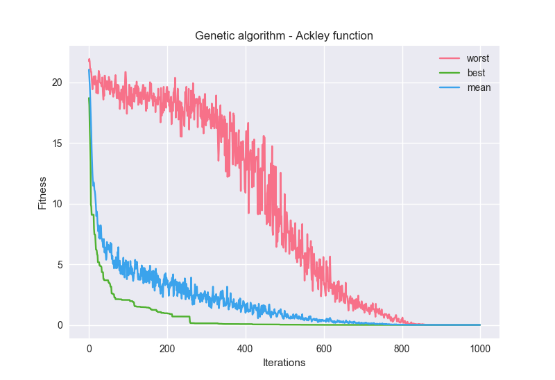
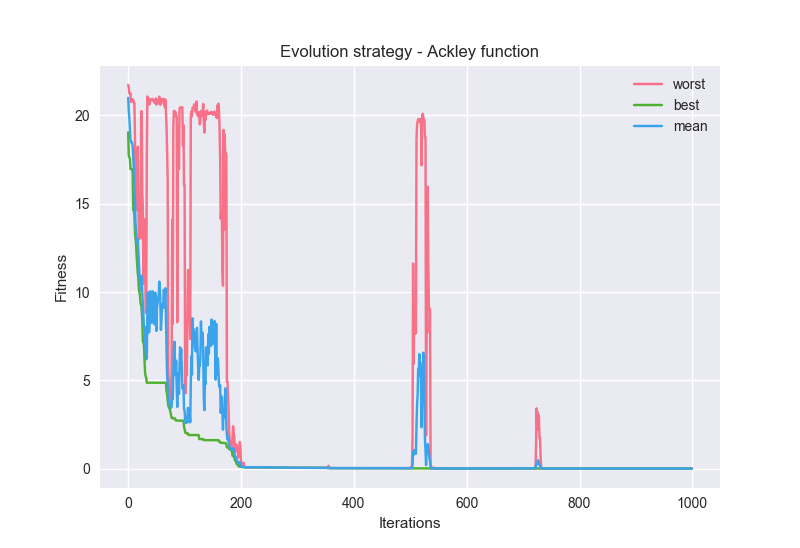

# [Under construction]

# Evolutionary Algorithms Library (EAL)

The following library wraps the evolutionary process of the evolutionary algorithms to make them easier to use.
It has a modular structure that makes easy to implement new operators for the selection, crossover, mutation, replacement operations or optimization functions.

The EAL library includes:
- [x] Single-run Logger
- [x] Multi-run Logger
- [x] File logging and plotting
- [x] Optimization Functions
- [x] Built-in simple mutations
- [x] Built-in simple crossovers
- [x] Built-in simple selection methods
- [x] Built-in simple replacement methods
- [x] Genetic Algorithms process
- [x] Evolutionary strategies process (simple version (1 sigma))
- [ ] Evolutionary strategies (array of sigmas)
- [x] [A Grid-based Genetic Algorithm for Multimodal Real Function Optimization](http://www.ia.uned.es/~ejcarmona/publicaciones/[2012-Chaquet&Carmona]%20ECTA-2012.pdf) by Jose Chaquet and Enrique Carmona

## Optimization functions
The optimization functions are adapted pieces of code, obtained from the [web](https://www.sfu.ca/~ssurjano/)

In particular, the library has implemented the following functions:
- **Ackley**
- **Forrester**
- **Beale**
- **Rothyp**
- **Booth**
- **Easom**
- **Griweank**
- **Matyas**
- **Powell**
- **Zakharov**
- **Sphere**
- **Schwefel**
- **Rastrigin**

An example of some of the functions plotted can be found [here](notebooks/functions_visualization.ipynb)

## EAL class
The EAL class is a wrapper of the evolutionary process. It accepts a great number of parameters that
set up the evolutionary algorithm.
It puts together all the implemented features and operators and supports different
evolutionary paradigms like: *Genetic Algorithms (ga)*, *Evolution Strategies (es)* or *Grid-Based Genetic Algorithms (gga)*

### Initialization Parameters

 - **n_dimensions**: number of dimensions used to solve the problem. *[10]*
 - **n_population**: size of the population (its number of chromosomes). *[100]*
 - **n_iterations**: number of iterations to do. *[1000]*
 - **n_children**: number of childrens to generate. *[100]*
 - **xover_prob**: croosover probability. *[0.8]*
 - **mutat_prob**: mutation probability. *[0.1]*
 - **minimization**: True if we want to minimize the objetive function. *[False]*
 - **seed**: set the seed for reproducibility. *[12345]*
 - **initialization**: How to initialize the population. ['uniform']
   - *'permutation'*: Each chromosome is a permutation of n_dimensions.
   - *'uniform'*: Initialize each chromosome randomly sampling it from a uniform distribution.
 - **problem**: sets the objetive function. *[Acley]*
 )]*
 - **selection**: sets the selection function (check [Selection section](#selections)). *['wheel']*
    - *'Tournament'*:
    - *'Wheel'*
 - **crossover**: sets the crossover operator (check [Crossovers section](#crossovers)). *['blend']*
    - *'one-point'*
    - *'one-point-permutation'*
    - *'two-point'*
    - *'blend'*
 - **mutation**: sets the mutation operator(check [Mutation section](#mutations)). *['non-uniform']*
    - *'pos-swap'*
    - *'uniform'*
    - *'non-uniform'*:
    - *'gaussian'*
 - **replacement**: (check [Replacement section](#replacements)). *['elitist']*
    - *'Elitist'*:
    - *'Worst-parents'*:
 - **tournament_competitors**: number of competitors in the tournament selection. *[3]*
 - **tournament_winners**: number of winners in the tournament selection. *[1]*
 - **replacement_elitism**: rate of eletism for the eletist replacement. *[0.5]*

## Initializations
[TODO]: rewrite and explain each method
- **uniform** uses a uniform distribution to sample the elements.
- **permutation** creates a permutation of *N* elements.

## Selections
[TODO]: rewrite and explain each method
- **wheel**: sample from the parents population with a probability of each member proportional to the value of their fitness
- **tournament**:

## Mutations
[TODO]: rewrite and explain each method
- **position swap**:
- **uniform**:
- **non-uniform**:
- **gaussian**: (Note: this is the mutation used for Evolutionary Strategies (es))

## Crossovers
[TODO]: rewrite and explain each method
- **one-point**:
- **one-point (permutation)**:
- **two-point**:
- **blend**:

## Replacements
[TODO]: rewrite and explain each method
- **worst-fitness**: removes the chromosomes inside the parensts population with the worst fitness.
- **elitist**:

## Code example

### Use of Genetic Algorithms
```python
from evolutionary import EAL, optim_functions as functions

# Example of a Genetic Algorithm to solve the ackley function
eal_ga = EAL(
    seed=82634,
    minimization=False,
    problem=functions.Ackley,
    n_dimensions=10,
    n_population=100,
    n_iterations=1000,
    n_children=100,
    xover_prob=0.8,
    mutat_prob=0.1,
    selection='wheel',
    crossover='blend',
    mutation='non_uniform',
    replacement='elitist'
)
eal_ga.fit(type="ga")
```

Graph returned after the 1000 iterations using a Genetic Algorithm with Wheel selection, Blend
Crossover, Non-Uniform mutation and Elitist replacement. It tries to find the global minima in the
Ackley Function with a croosover probability of 0.8 and mutation probability of 0.1. The number of 
chromosomes in the population is 100 and the number of generated children is also 100.




### Use of Evolutionary Strategies

```python
from evolutionary import EAL, optim_functions as functions

# Example of a Evolutionary Strategy to solve the ackley function
eal_es = EAL(
    seed=82634,
    minimization=False,
    problem=functions.Ackley,
    n_dimensions=10,
    n_population=50,
    n_iterations=1000,
    n_children=50,
    xover_prob=0.8,
    mutat_prob=0.2,
    selection='tournament',
    crossover=None,
    mutation='gaussian',
    replacement='elitist'
)

eal_es.fit(type="es")
```

Graph returned after the 1000 iterations using an Evolutionary Strategy with Tournament selection, it doesn't apply any croosover operator, Gaussian mutation with a global sigma value and Elitist replacement. It tries to find the global minima in the
Ackley Function with a mutation probability of 0.1. The number of 
chromosomes in the population is 50 and the number of generated children is also 50.


